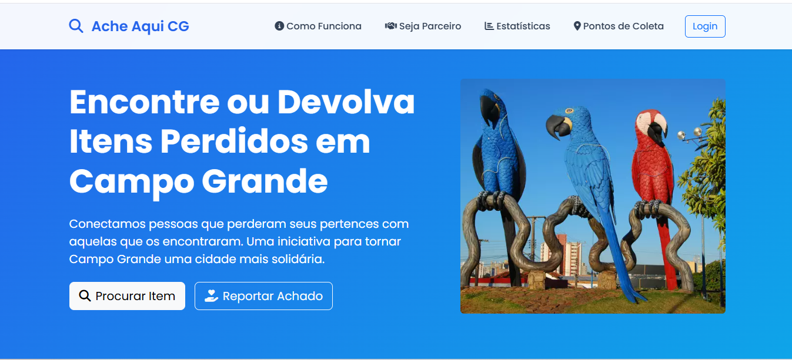

# Sistema Colaborativo de Achados e Perdidos

  

## Sobre o Projeto

Este sistema foi desenvolvido como Trabalho de Conclusão de Curso (TCC) com o objetivo de criar uma plataforma colaborativa para gerenciamento de itens perdidos e encontrados em uma cidade. A solução conecta cidadãos e estabelecimentos parceiros, facilitando a recuperação de objetos perdidos através de uma abordagem comunitária.

## Principais Funcionalidades

### Para Usuários
- Cadastro e gerenciamento de itens perdidos
- Cadastro e gerenciamento de itens encontrados
- Visualização de itens em mapa interativo
- Sistema de busca e filtros por categoria, localização e data
- Notificações sobre itens correspondentes
- Chat integrado para comunicação entre usuários

### Para Estabelecimentos Parceiros
- Cadastro como ponto oficial de coleta e devolução
- Gerenciamento de itens recebidos
- Transferência de itens entre estabelecimentos
- Confirmação de devoluções

### Para Administradores
- Aprovação de cadastros de parceiros
- Moderação de itens cadastrados
- Visualização de estatísticas e relatórios
- Gerenciamento de categorias e localizações

## Tecnologias Utilizadas

- **Backend:** Laravel (PHP)
- **Frontend:** Bootstrap, JavaScript, jQuery
- **Banco de Dados:PostgreSQL**
- **Mapa Interativo:** Google Maps API
- **Notificações:** Sistema de e-mail e notificações em tempo real
- **Chat:** Sistema de mensagens integrado

## Proposta de Valor

O sistema visa solucionar um problema comum em cidades de todos os portes: a dificuldade em recuperar itens perdidos. Através de uma abordagem colaborativa, o projeto propõe:

1. **Centralização de informações:** Um único local para registrar e buscar itens perdidos ou encontrados
2. **Rede de parceiros:** Estabelecimentos comerciais, eventos e instituições como pontos oficiais de coleta

3. **Acessibilidade:** Interface intuitiva e disponível em dispositivos móveis

## Sobre o TCC

Este projeto foi desenvolvido como Trabalho de Conclusão de Curso e representa uma proposta de implementação para cidades brasileiras. O sistema foi projetado considerando aspectos de usabilidade, segurança e escalabilidade.

[Link para o texto completo do TCC](https://drive.google.com/file/d/16pGJrf6n35dtFM6vX08GtszVrnoS_o_F/view?usp=sharing)

## Contato

Para mais informações sobre este projeto ou para discutir possíveis implementações, entre em contato:

- **Nome:** Gustavo Henrique
- **E-mail:** gustavo.henrique.dev0@gmail.com

- **GitHub:** [GitHub](https://github.com/Gustavo-Henrique01)

## Licença

Este projeto está licenciado sob a [MIT License](https://opensource.org/licenses/MIT).
